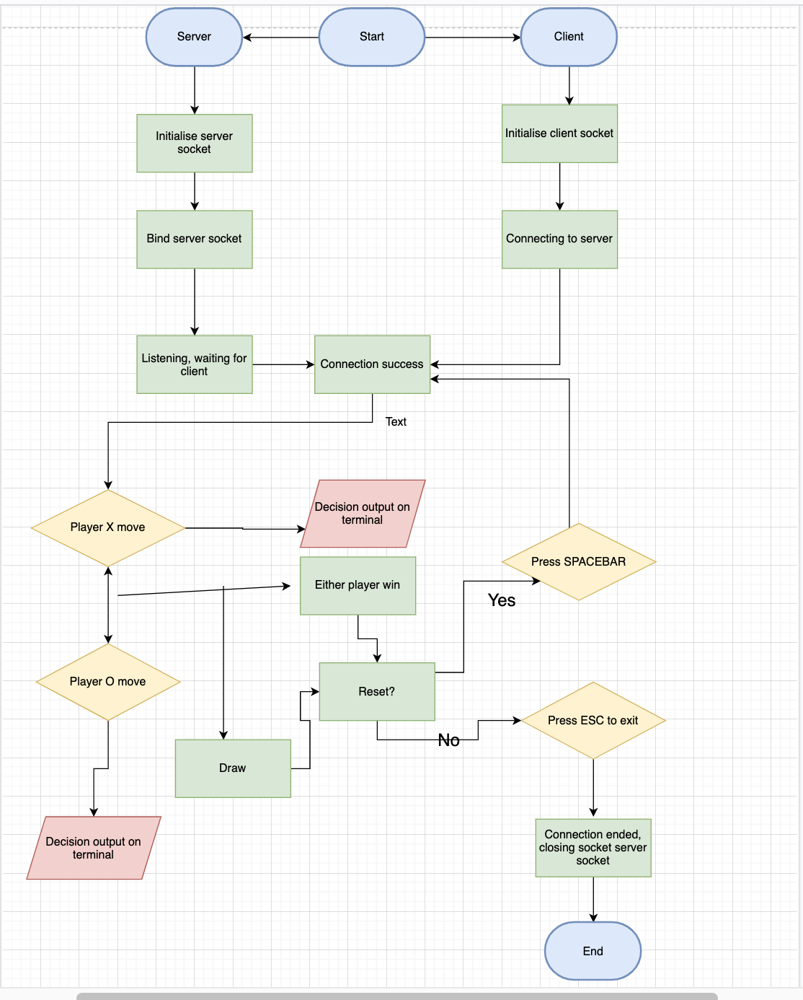

# T2A3:

# Application: Tic-Tac-Toe - Wilson Ngo - CCC

## Application Outline + Description

#### The application developed is a 2-player game "Tic-Tac-Toe", where the server launched is player 1 (X) and player 2(O) is the client. The server(X) will always start first. Input is taken through a mouse click, specifically the left-click button which is also known as index[0]. Each player has to double left-click to confirm their choice on the grid. Output is then displayed through pygame and also terminal will provide an output confirming a player has taken their turn. Once either player scores a combination of 3 on the grid, it is game over and then terminal will confirm that either Player X or Player O has won. After that the game can be reset by either user pressing the "SPACEBAR" key, or they can exit the application by pressing the "ESC" key in which the application will close. If it results in a draw, either player can reset with the "ESC" key. The application runs off a main loop that determines the position of the left-click on the board when clicked. Data is transmitting once a decision has been made by either side, hence, a communication is active. When the game is reset, the starting player of the first game will start second in the next game.

To get the game running make sure the following dependencies are required:
<pre>import socket</pre>
<pre>import threading</pre>
<pre>import pygame</pre>
<pre>import os</pre>
The socket, threading and os module are already inbuilt in python, therefore only pygame needs be installed prematurely through pip via the terminal:
<pre>pip3 install pygame</pre>
Once the dependencies are installed, simply, run the following in terminal:
<pre>tic-tac-toe_server.py</pre>
followed by:
<pre>tic-tac-toe_client.py</pre>
Enjoy!
 

## Classes and Functions

The application has main game loop and also a primary class (Grid), which is the foundation of the application. Grid() allows the board to be visualised and within the class, there are methods and functions that apply the game logic: How a winner is determined, what happens if it results in a draw, resetting the game, and exiting the application.

## Networking (sockets)

When a player makes a move, data is encoded and sent. Following that, the data is decoded on the other end. Terminal will output a message confirming that a player has taken their turn. This is all running under the receive_data() function. Threading allows data to be sent from the server and from the client back to the server.

## Flowchart:

## Game status: Working!

Note: My sincerest apologies for the error handling, I wasn't sure how to approach it. 